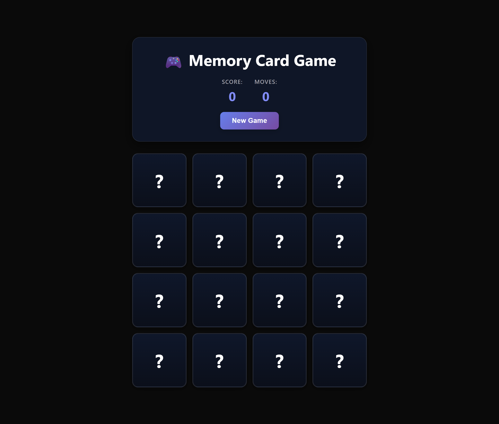

# Card Memory Game 🎮

Um jogo da memória feito com React e Vite, onde o objetivo é encontrar todos os pares de cartas com o menor número de jogadas possível.



## Funcionalidades

- Tabuleiro 4x4 com 8 pares de cartas (emojis de frutas)
- Embaralhamento aleatório das cartas a cada nova partida
- Contador de pontuação (pares encontrados) e de jogadas
- Animação de virar carta e destaque visual para pares encontrados
- Mensagem de vitória ao completar o jogo
- Botão "New Game" para reiniciar a qualquer momento
- Layout responsivo para desktop e mobile

## Tecnologias

- [React](https://react.dev/) 19
- [Vite](https://vitejs.dev/) 8

## Como executar o projeto

O código do jogo fica na pasta `CardMemoryGame`.

```bash
cd CardMemoryGame
npm install
npm run dev
```

Depois, acesse o endereço exibido no terminal (geralmente `http://localhost:5173`).

## Estrutura do projeto

```
CardMemoryGame/
├── public/              # arquivos estáticos (ícones, screenshots)
├── src/
│   ├── Components/
│   │   ├── Card.jsx        # carta individual do jogo
│   │   ├── GameHeader.jsx   # cabeçalho com pontuação, jogadas e botão de reset
│   │   └── WinMessage.jsx   # mensagem exibida ao vencer
│   ├── hooks/
│   │   └── useGameLogic.js  # lógica do jogo (embaralhar, virar, comparar cartas)
│   ├── App.jsx
│   ├── main.jsx
│   └── index.css
└── index.html
```

## Como jogar

1. Clique em uma carta para virá-la.
2. Clique em uma segunda carta para tentar formar um par.
3. Se as cartas forem iguais, elas permanecem viradas e contam como ponto.
4. Se forem diferentes, elas voltam a ficar viradas para baixo.
5. O jogo termina quando todos os pares forem encontrados.
